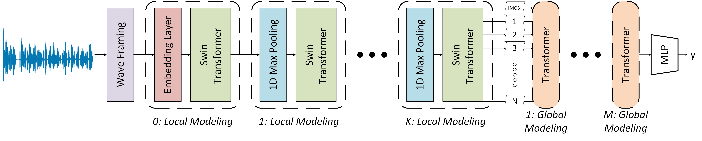

# AttentiveMOS

<p align="center">
  
</p>

<p>
  <strong>Keywords:</strong> speech quality assessment, mean opinion score, no-reference speech quality estimation, swin-transformers, subjective bias.
</p>

AttentiveMOS is a lightweight (86K params) deep learning model for estimating subjective speech quality scores. It leverages attention-based mechanism to predict Mean Opinion Score (MOS). The model is trained on multiple speech quality datasets and can generalize across different domains.

This repository contains the complete pipeline for data preparation, model training, and evaluation.

### Supported Datasets

**Training Datasets:**
1) BVCC (Blizzard Voice Conversion Challenge)
2) NISQA (Non-Intrusive Speech Quality Assessment)
3) PSTN (Public Switched Telephone Network)
4) SingMOS
5) SOMOS (Samsung Open Mean Opinion Score)
6) TENCENT
7) TMHINTQI

**Testing Datasets:**
1) BVCC 
2) NISQA-FOR
3) NISQA-P501
4) NISQA-LIVETALK
5) SingMOS
6) SOMOS
7) TMHINTQI
8) BC-19 (Blizzard Challenge) 
9) VMC'23 (Voice MOS Conversion Challenge) Track-1a
10) VMC'23 Track-1b
11) VMC'23 Track-2
12) VMC'23 Track-3

## Usage Workflow

### 1. Data Preparation
```bash
# Organize your raw audio and score files in data_preparation/ directories
# Run the data preparation pipeline to generate TFDS
```

### 2. Training
```bash
# Configure training parameters in data_modeling/params.py
# Run training:
python data_modeling/train.py
# or for HPC:
sbatch data_modeling/train.sh
```

### 3. Testing
```bash
# Run evaluation on test sets:
python data_modeling/test.py
# or for HPC:
sbatch data_modeling/test.sh
```

### 4. Analysis
- Check evaluation results in the `evaluation/` directory
- Analyze model performance metrics
- Review checkpoint results

### Environment Setup

1. Clone the repository:
```bash
git clone <repository-url>
cd AttentiveMOS
```

2. Create a Conda environment:
```bash
conda create -n env python=3.10
conda activate env
```

3. Install dependencies:
```bash
pip install -r requirements.txt
```

## 1. Data Preparation

### Generating TensorFlow Datasets (TFDS)

The data preparation pipeline converts raw audio and corresponding quality scores into TensorFlow Datasets format for efficient model training and testing.

#### Structure

```
data_preparation/
├── training_datasets/     # Training data sources
│   ├── bvcc/
│   ├── nisqa/
│   ├── pstn/
│   ├── singmos/
│   ├── somos/
│   ├── tencent/
│   └── tmhintqi/
└── testing_datasets/      # Testing data sources
    └── benchmark/
```

#### Preparation Steps

Run the data preparation scripts to generate TFDS:

1. Navigate to the desired dataset directory:
   ```bash
   cd data_preparation/training_datasets/bvcc
   ```

2. Execute the TensorFlow Datasets build command:
   ```bash
   tfds build --data_dir=/path/to/desired/directory
   ```

   Example:
   ```bash
   tfds build --data_dir=Data/Speech/MOS_datasets/bvcc
   ```

The generated datasets will be in TensorFlow Datasets format.

## 2. Training

### Training Configuration

The model training is configured through `data_modeling/params.py` which contains:
- Model architecture parameters
- Training hyperparameters (learning rate, batch size, epochs)
- Data augmentation settings
- Regularization parameters

### Running Training

#### Local Training
```bash
python data_modeling/train.py
```

#### HPC/SLURM Cluster Training
```bash
sbatch data_modeling/train.sh
```

The `train.sh` script includes SLURM configuration for:
- Single GPU allocation
- Memory allocation (64GB)
- CPU cores (8 per task)
- Output logging to `checkpoints/seeds/999/train_log.out`

### Training Outputs

- **Checkpoints**: Saved in `checkpoints/` directory
- **Training logs**: Detailed loss and metric logs
- **Model weights**: Saved at specified intervals

## 3. Testing

### Running Tests

#### Local Testing
```bash
python data_modeling/test.py
```

#### HPC/SLURM Cluster Testing
```bash
sbatch data_modeling/test.sh
```

The `test.sh` script includes SLURM configuration for:
- Single GPU allocation
- Memory allocation (64GB)
- CPU cores (8 per task)
- Output logging to `evaluation/seeds/999/test_log.out`

### Evaluation Outputs

- **Predictions**: Model predictions on test datasets
- **Metrics**: Correlation coefficients (Pearson, Spearman)
- **Analysis results**: Saved in `evaluation/seeds/999` directory

## Project Structure

```
AttentiveMOS/
├── data_modeling/          # Model training and testing
│   ├── train.py           # Training script
│   ├── train.sh           # SLURM training job script
│   ├── test.py            # Testing script
│   ├── test.sh            # SLURM testing job script
│   ├── model.py           # Model architecture
│   ├── callbacks.py       # Training callbacks
│   ├── params.py          # Configuration parameters
│   └── example_inputs/    # Example input data specifications
├── data_preparation/      # Data preprocessing and TFDS generation
│   ├── training_datasets/ # Training data sources
│   └── testing_datasets/  # Testing data sources
├── evaluation/            # Evaluation results and analysis
├── checkpoints/           # Model checkpoints and weights
├── requirements.txt       # Python dependencies
└── README.md             # This file
```

## Citation

If you use this code in your research, please cite:
```
@inproceedings{kibria25_interspeech,
  title     = {{AttentiveMOS: A Lightweight Attention-Only Model forSpeech Quality Prediction}},
  author    = {Imran E Kibria and Donald S. Williamson},
  year      = {2025},
  booktitle = {{Interspeech 2025}},
  pages     = {2340--2344},
  doi       = {10.21437/Interspeech.2025-2315},
  issn      = {2958-1796},
}
```

---